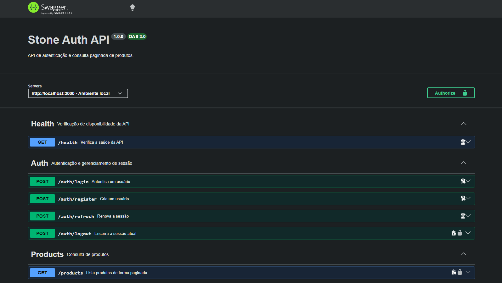
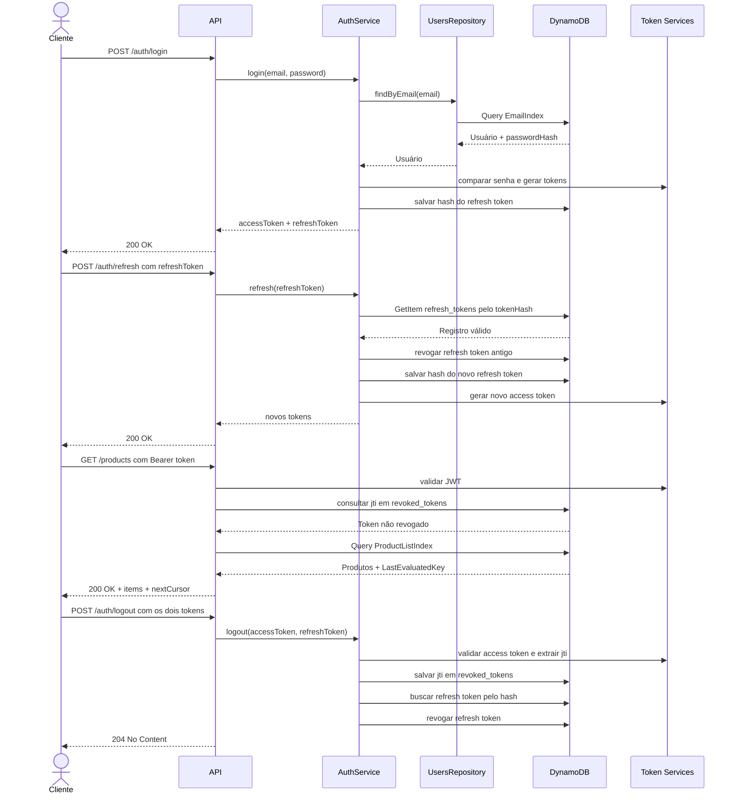

# Stone Auth API


API desenvolvida para o desafio técnico de Senior Software Engineer da Stone.
O projeto implementa autenticação, refresh token com rotação, logout com
revogação de tokens e listagem paginada de produtos usando DynamoDB.



> O print acima representa a documentação Swagger durante o desenvolvimento.
> A documentação atual também inclui o endpoint `POST /auth/register`.

## Pré-requisitos

Para executar o projeto pelo fluxo recomendado, instale:

- [Docker Engine](https://docs.docker.com/engine/install/) e o
  [Docker Compose](https://docs.docker.com/compose/install/); ou
- [Docker Desktop](https://docs.docker.com/desktop/), que já inclui o Docker
  Engine e o Docker Compose;
- [Git](https://git-scm.com/downloads), para clonar o repositório.

Node.js e npm não são necessários para executar a aplicação com Docker. Eles são
necessários apenas para desenvolvimento local, execução direta dos testes ou
execução direta do build.

## Configuração

Copie o arquivo de ambiente de exemplo:

```bash
cp .env.example .env
```

No PowerShell, use:

```powershell
Copy-Item .env.example .env
```

O arquivo `.env` não deve ser commitado. Em ambientes reais, substitua o valor
de `JWT_SECRET` por um segredo seguro.

## Executando com Docker

Construa as imagens e suba os serviços:

```bash
docker compose up --build
```

O Compose inicia:

- a API Node.js na porta `3000`;
- o DynamoDB Local na porta `8000`;
- a criação das tabelas;
- sem executar o seed automaticamente.

O seed é uma operação explícita, executada separadamente:

```bash
docker compose run --rm api node dist/scripts/seed.js
```

Esse comando insere o usuário local e os produtos de exemplo. Pode ser
executado novamente em desenvolvimento; os itens usam chaves determinísticas
e serão substituídos, não duplicados.

Verifique os containers:

```bash
docker compose ps
```

Para encerrar os serviços:

```bash
docker compose down
```

Para remover também os dados persistidos do DynamoDB Local:

```bash
docker compose down -v
```

## Endpoints

| Método | Rota | Descrição | Autenticação |
| --- | --- | --- | --- |
| GET | `/health` | Verifica a saúde da API | Não |
| GET | `/docs` | Abre a documentação Swagger | Não |
| POST | `/auth/register` | Cria um usuário | Não |
| POST | `/auth/login` | Autentica um usuário | Não |
| POST | `/auth/refresh` | Renova a sessão | Não |
| POST | `/auth/logout` | Encerra a sessão | Access token |
| GET | `/products` | Lista produtos paginados | Access token |

A API estará disponível em:

```text
http://localhost:3000
```

A documentação estará disponível em:

```text
http://localhost:3000/docs
```

## Usuário local

O seed cria o usuário:

```text
E-mail: demo@example.com
Senha: Password123!
```

Essas credenciais existem apenas para facilitar o desenvolvimento local.

## Fluxo de autenticação

1. Execute o seed ou crie um usuário em `POST /auth/register`.
2. Faça login em `POST /auth/login`.
3. Use o `accessToken` no header `Authorization`.
4. Acesse `GET /products`.
5. Use `POST /auth/refresh` para rotacionar a sessão.
6. Use `POST /auth/logout` para invalidar os tokens.

## Fluxo principal



Exemplo de header protegido:

```text
Authorization: Bearer <accessToken>
```

## Desenvolvimento local com Node.js

Como alternativa ao Docker, usando Node.js 22 ou superior:

```bash
npm install
npm run db:create-tables
npm run db:seed
npm run dev
```

Para verificar o projeto:

```bash
npm test -- --runInBand
npm run build
```

## Documentação da estrutura

Consulte [`docs/structure.md`](docs/structure.md) para entender a organização
das pastas e a responsabilidade de cada camada.

Consulte [`docs/dependencies.md`](docs/dependencies.md) para ver as dependências
do projeto e o motivo de cada uma.

## Decisões arquiteturais

As decisões relevantes estão documentadas em [`docs/adr/README.md`](docs/adr/README.md).
